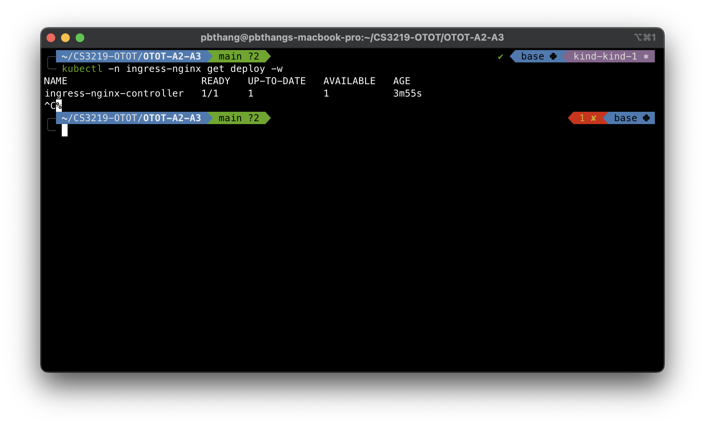

# OTOT Task A2 Report

Name: Pham Ba Thang \
Matric No: A0219715B \
Repo: [https://github.com/pbthang/OTOT-A2-A3](https://github.com/pbthang/OTOT-A2-A3)

## Task A2.1

- Create a cluster using `kind`:

  ```zsh
  kind create cluster --name kind-1 --config k8s/kind/cluster-config.yaml
  ```

  

- Verify cluster and nodes are running:

  ```zsh
  kubectl cluster-info --context kind-kind-1
  kubectl get nodes --context kind-kind-1 -o wide
  ```

  

## Task A2.2

- Create a deployment:

  ```zsh
  kubectl apply -f k8s/manifests/backend-deployment.yml
  ```

- Verify that deployments/pods is running:

  ```zsh
  kubectl get deploy/backend --watch
  kubectl get po -lapp=backend --watch
  ```

  

- Create Ingress controller (nginx-ingress-controller) and verify it

```zsh
kubectl apply -f https://raw.githubusercontent.com/kubernetes/ingress-nginx/main/deploy/static/provider/kind/deploy.yaml
kubectl -n ingress-nginx get deploy -w
```




- Create a Service and verify it

```zsh
kubectl apply -f k8s/manifests/backend-service.yml
kubectl get svc
```


## Task A2.3

- Create an Ingress and verify it

```zsh
kubectl apply -f k8s/manifests/backend-ingress.yml
kubectl get ingress -w
```


If you succeed, then you should see this on [`http://localhost`](http://localhost):


