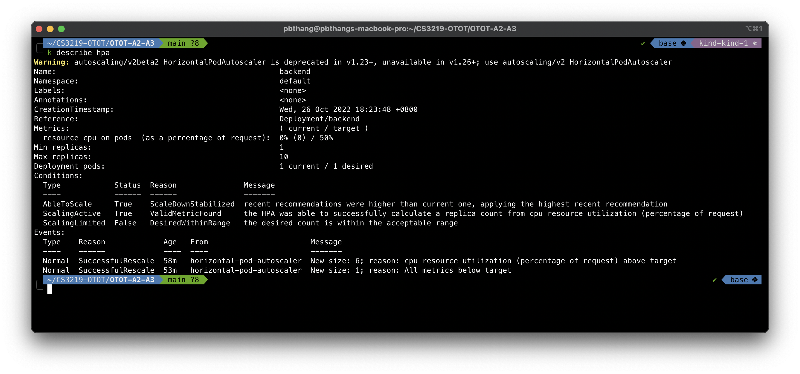

# OTOT Task A3 Report

Name: Pham Ba Thang \
Matric No: A0219715B \
Repo: [https://github.com/pbthang/OTOT-A2-A3](https://github.com/pbthang/OTOT-A2-A3)

## Task A3.1

- Create a metrics server and verify that it is working:

```zsh
kubectl apply -f k8s/kind/metrics-server.yml
kubectl -nkube-system get deployment -w
```


- Create a `HorizontalPodAutoscaler` and verify that it is working:

```zsh
kubectl apply -f k8s/manifests/backend-hpa.yml
kubectl get hpa
```


- Perform load test using a tool of your choice, A script `stress_test.sh` for load testing is provided in the repo. Run `kubectl get po` to get the number of replica pods running.

<figure>
    
    <figcaption align="center">Initial scaling: 3 replicas</figcaption>
</figure>

<figure>
    
    <figcaption align="center">After load test: 6 replicas</figcaption>
</figure>

<figure>
    
    <figcaption align="center">After a long idle period: 1 replica</figcaption>
</figure>

- Verify the events happening during the load test:

```zsh
kubectl describe hpa/backend
```



## Task A3.2

- View the nodes with their zones:

```zsh
kubectl get nodes -L topology.kubernetes.io/zone
```


- Create a zone-aware backend deployment and verify that it is working:

```zsh
kubectl apply -f k8s/manifests/backend-zone-aware-deployment.yml
kubectl get deploy/backend-zone-aware -w
```


- Verify that the Pods are distributed evenly across the two zones:

```zsh
kubectl get po -lapp=backend-zone-aware -owide --sort-by='.spec.nodeName'
```


